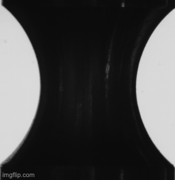
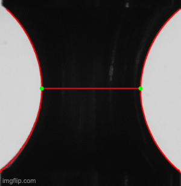

# CppEdgeTracking

EdgeTracking (ET) is an image analysis program that detects and analyzes the contours of 
[mechanical tensile testing samples](https://en.wikipedia.org/wiki/Tensile_testing). 

  

## Project Goal
The ET code takes a number of images and an input file holding the path to all images and some information about each image. Each image is than processed to detect the contours of the given sample. The contours are then analyzed to extract the needed information. The output is by default a csv file that contains all data. If Save is set to true, all analyzed images will be given as output as well.

## Project structure
1. `EdgeTracking.cpp` Contains the main function which parsers the input parameters and the input file. Then, the program can run with or without concurrency. The submitted version runs with concurrency (lines 82-135) 
* The project uses smart pointers instead of raw pointers(lines 86-87).
* A mutex or lock is used in the project(lines 87).
* The project uses multithreading(lines 85-133).
* The project accepts user input and processes the input (lines 22-28).

2. `Parser.h` Contains two classes. Polymorphisim is elaborated here. This file shows the comprehension of OOP.
* Class constructors utilize member initialization lists(lines 64-68).
* Classes follow an appropriate inheritance hierarchy(lines 36-37).

3. `Parser.cpp` Contains the methods of two classes that read data from input file and write data to the output file.

4. `ImageProcessing.h` Classes implemented here analyze the object image. Smart pointers are used here and the rule of 5 is implemented on lines 46-51. Mutexes and locks are implemented in the cpp to protect the screen while printing. Condition variable is used in Queue Manager templated class at lines 27-35 
* The project uses destructors appropriately(lines 41).
* The project makes use of references in function declarations(lines 42-44).
* Templates generalize functions in the project (lines 27-36).
* The project reads data from a file and process the data, or the program writes data to a file(lines 30-62).

5. `ImageProcessing.cpp` Contains all methods of the templated class 'QueueManager' and the methods of ImageProcessing. The method 'ImageProcessing::Process' is the one that 
* The project uses move semantics to move data, instead of copying it, where possible(lines 34).
* The project follows the Rule of 5(lines 39-146).
* Classes use appropriate access specifiers for class members(lines 53-56).
* A condition variable is used in the project(lines 18-37).

## Where to find the code

Please refer to the following git project where I first implemented the code and a mentor asked me to update the README. Therefore, I created this README for the ND.

https://github.com/MohamedShokeir/CppEdgeTracking.git

## Dependencies for Running Locally
* cmake >= 2.8
  * All OSes: [click here for installation instructions](https://cmake.org/install/)
* make >= 4.1 (Linux, Mac), 3.81 (Windows)
  * Linux: make is installed by default on most Linux distros
  * Mac: [install Xcode command line tools to get make](https://developer.apple.com/xcode/features/)
  * Windows: [Click here for installation instructions](http://gnuwin32.sourceforge.net/packages/make.htm)
* OpenCV >= 4.1
  * The OpenCV 4.1.0 source code can be found [here](https://github.com/opencv/opencv/tree/4.1.0)
* gcc/g++ >= 5.4
  * Linux: gcc / g++ is installed by default on most Linux distros
  * Mac: same deal as make - [install Xcode command line tools](https://developer.apple.com/xcode/features/)
  * Windows: recommend using [MinGW](http://www.mingw.org/)

## Building and Running

### Building
```bash
git clone https://github.com/MohamedShokeir/CppEdgeTracking.git
cd CppEdgeTracking/
make build
```

### Make
This project uses [Make](https://www.gnu.org/software/make/). The Makefile has four targets:
* `build` compiles the source code and generates an executable
* `format` applies [ClangFormat](https://clang.llvm.org/docs/ClangFormat.html) to style the source code
* `debug` compiles the source code and generates an executable, including debugging symbols
* `clean` deletes the `build/` directory, including all of the build artifacts

### Running
```bash
cd test/ 
../build/ET J47_NT10_E258.txt
```
OR
```bash
cd test1/ 
../build/ET J47_NT10_E258.txt
```

Please refer to `./CppEdgeTracking/test` to see an example of `file.txt`

## Contributing
Pull requests are welcome. For major changes, please open an issue first to discuss what you would like to change.

Please make sure to update tests as appropriate.

## License
